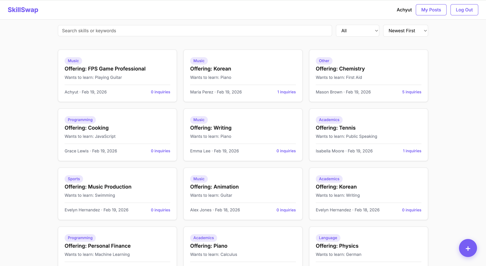
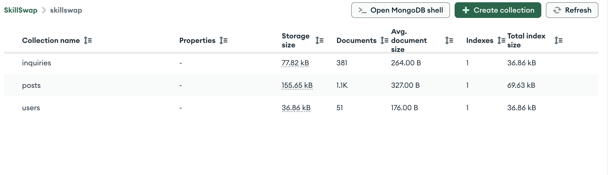
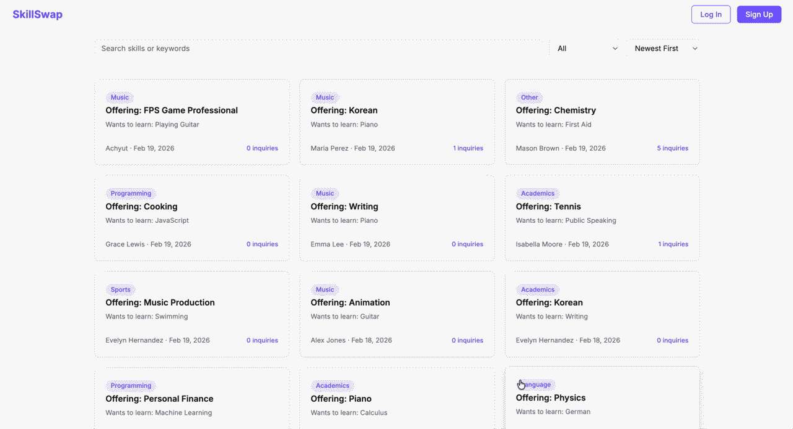
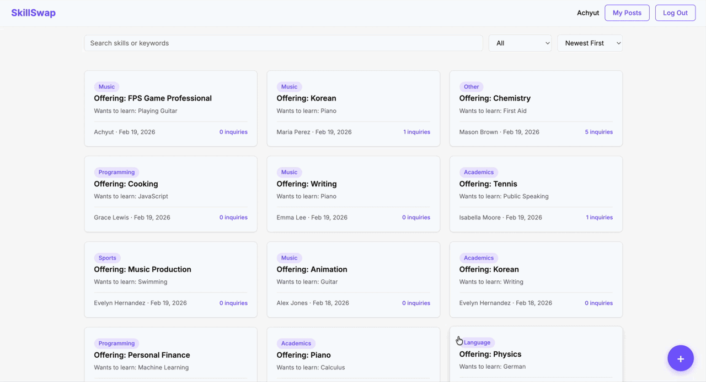
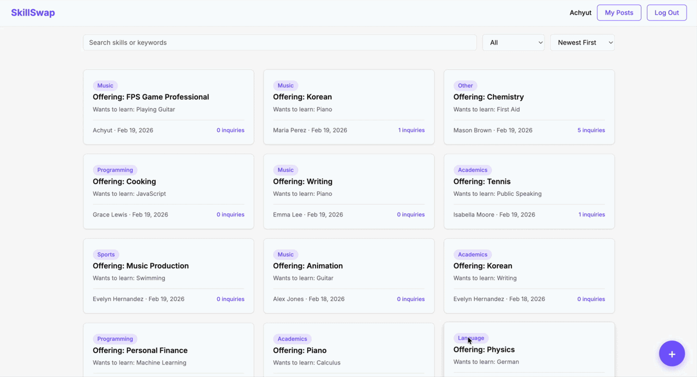
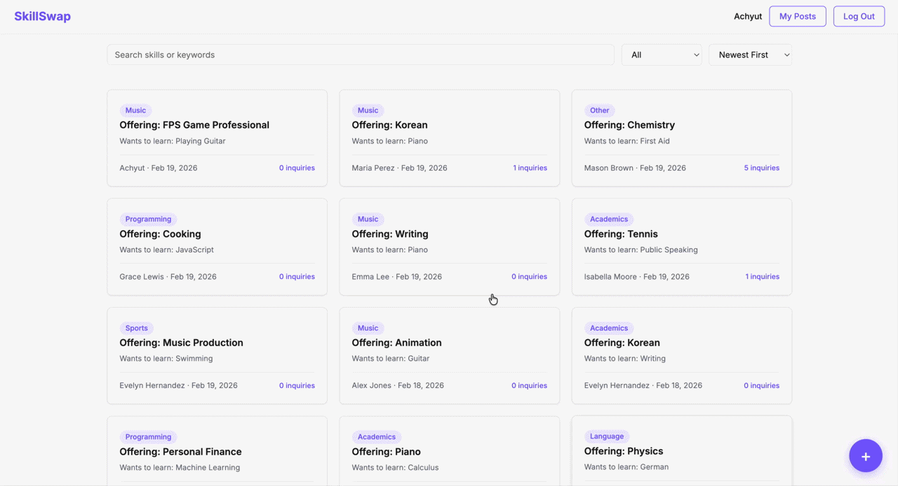
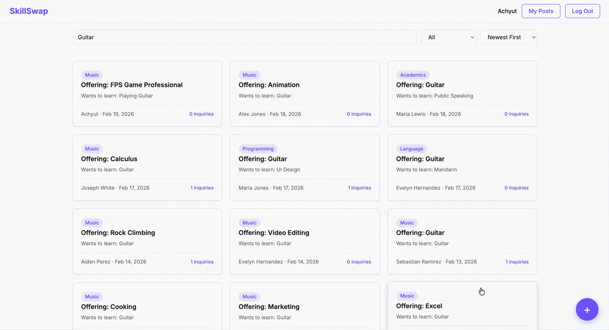
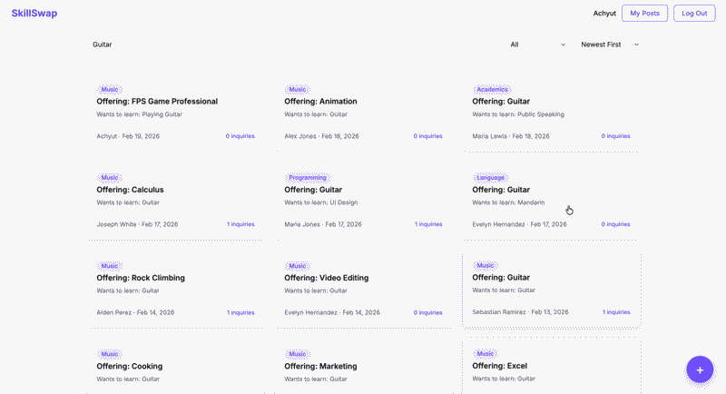

# SkillSwap

**Author:** Achyut Katiyar

**Class:** CS5610 Web Development — [https://johnguerra.co/classes/webDevelopment_online_spring_2026/](https://johnguerra.co/classes/webDevelopment_online_spring_2026/)

## Table of Contents

- [Project Objective](#project-objective)
- [Screenshot](#screenshot)
- [Design Document](#design-document)
- [Live Demo](#live-demo)
- [Tech Stack](#tech-stack)
- [Database](#database)
- [How to Use](#how-to-use)
- [Instructions to Build](#instructions-to-build)

## Project Objective

SkillSwap is a peer to peer skill exchange platform for students. Students can post what skills they can teach and what skills they want to learn. Other students can browse these posts, filter by category or keyword, and send inquiries to connect. The app removes the awkwardness of asking around in group chats and creates a simple space for peer to peer learning.

## Screenshot



## Design Document

[View on Figma](https://www.figma.com/design/c4AixRG9FlYkXetgPKfsfy/SkillSwap?node-id=0-1&t=oP6XeVJdUM2CDowP-1)

See the project proposal document for user personas, user stories, and design mockups.

## Live Demo

[Deployed on Vercel](to-doo)

## Tech Stack

Node.js, Express, MongoDB (native driver), vanilla JavaScript, HTML5, CSS

## Database

The app uses MongoDB Atlas with three collections: users, posts, and inquiries. The database is seeded with over 1000 records.



## How to Use

**Step 1: Create an account.** Click "Sign Up" in the top right corner. Enter your name, email, and password. After signing up you will be logged in automatically.


**Step 2: Log in.** If you already have an account, click "Log In" in the top right corner and enter your email and password.



**Step 3: Browse posts.** The home page shows all skill exchange posts. Use the search bar to find posts by skill name or keyword. Use the category dropdown to filter by category like Programming, Music, or Language. Use the sort dropdown to view newest posts first or posts with the most inquiries.



**Step 4: View post details.** Click on any post card to see the full details including the description, tags, and all inquiries that post has received.



**Step 5: Send an inquiry.** When viewing someone else's post, you will see an inquiry form at the bottom. Write a message introducing yourself and what you can offer in exchange. Click Send Inquiry to reach out.



**Step 6: Create a post.** Click the purple "+" button in the bottom right corner. Fill in the skill you can offer, the skill you want to learn, pick a category, write a short description, and optionally add tags. Click Save to publish your post.



**Step 7: Manage your posts.** Click "My Posts" in the nav bar to see all your posts. You can edit or delete any of your posts from there. You can also edit or delete from the post detail modal.



## Instructions to Build

1. Clone the repository

```bash
git clone https://github.com/yourusername/skillswap.git
cd skillswap
```

2. Install dependencies

```bash
npm install
```

3. Set up environment variables

```bash
cp .env.example .env
```

Edit `.env` and add your MongoDB Atlas connection string and a JWT secret.

4. Seed the database

```bash
npm run seed
```

5. Run locally

```bash
npm start
```

The app will be available at `http://localhost:3000`.
